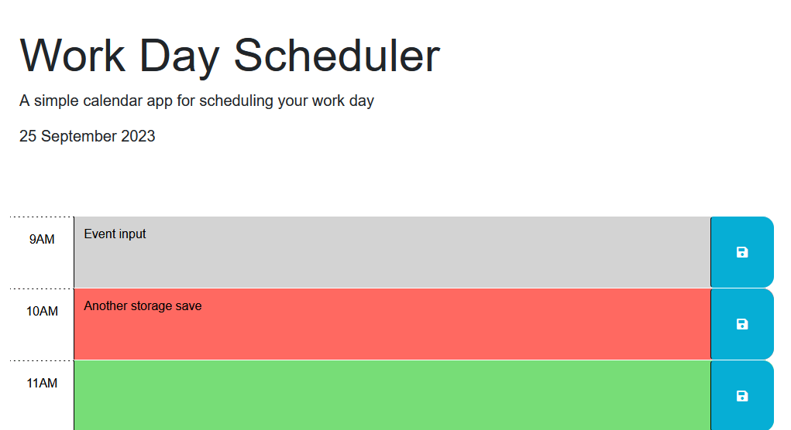

# Day Scheduler
A daily planner utilizing third party API's such as DayJS and JQuery, using interactive events and saving into local storage.

[Application Deployment]https://r-basu.github.io/day-scheduler/)

[Starter code used](https://github.com/coding-boot-camp/crispy-octo-meme)
